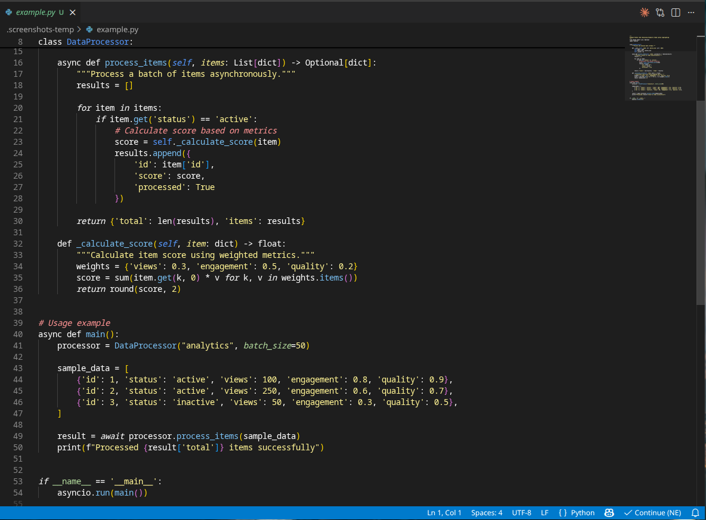
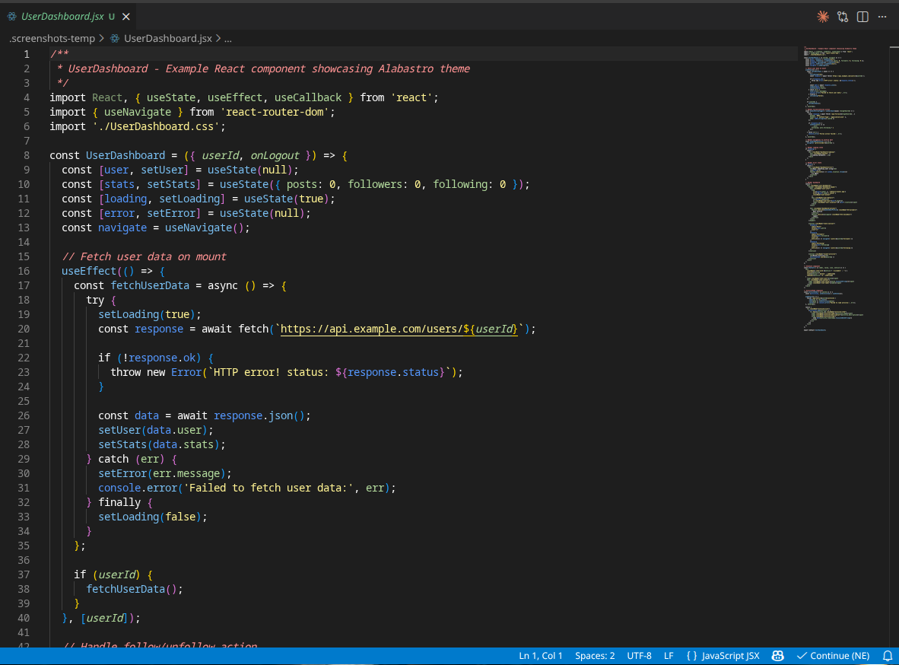
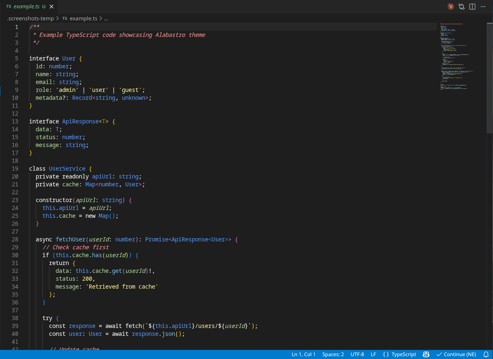
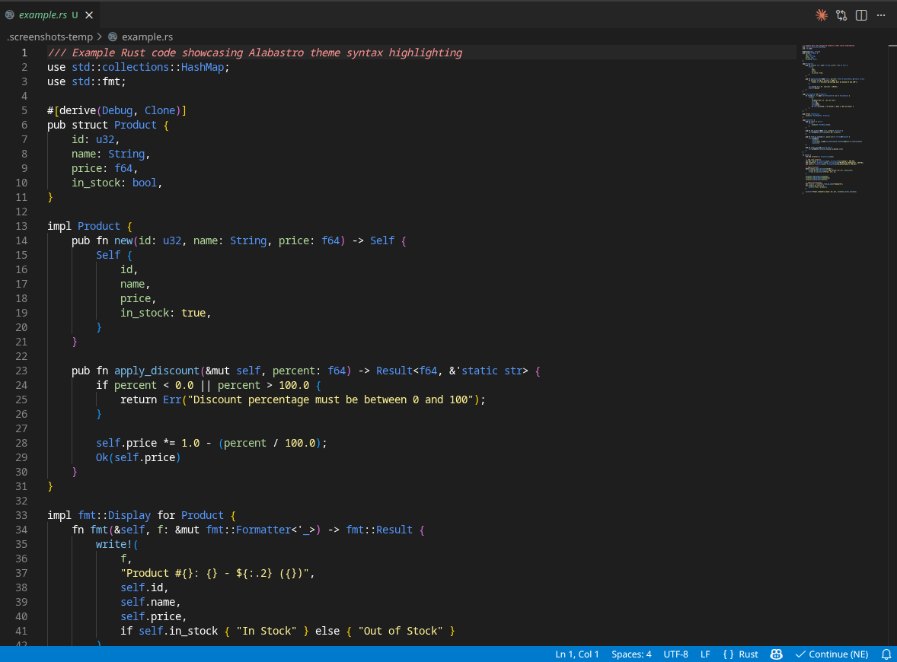
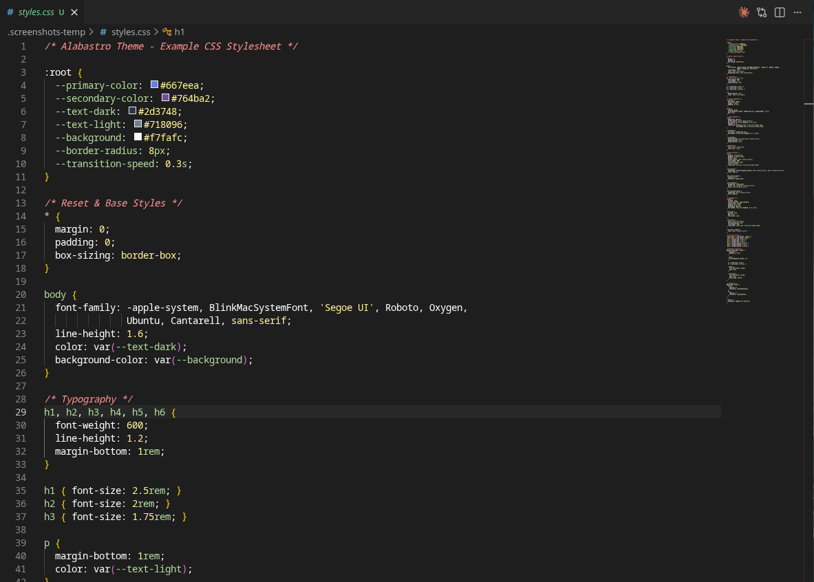

# Alabastro Theme for VS Code

A dark variation of the minimal [Alabaster syntax highlighting scheme](https://tonsky.me/blog/syntax-highlighting/) with enhanced colors and comprehensive UI customization for Visual Studio Code.

## About

Alabastro builds upon the philosophy of the original Alabaster theme—minimal, focused syntax highlighting that emphasizes what matters. While Alabaster uses a light background with limited colors, Alabastro adapts this approach for dark theme lovers and adds more semantic colors to enhance readability across a wider range of programming languages.

## Screenshots

### Full Editor View


### Syntax Highlighting Examples

#### Python


#### React/JSX


#### TypeScript


#### Rust


#### HTML


#### CSS


## Features

- **Dark, Eye-Friendly Design**: Carefully curated colors for reduced eye strain during extended coding sessions
- **Minimal Yet Enhanced**: Based on Alabaster's philosophy but with additional colors for better semantic differentiation
- **Comprehensive Language Support**: Optimized syntax highlighting for 40+ programming languages including:
  - Haskell, Python, Rust, Go, JavaScript/TypeScript
  - Elm, Clojure, Java, C/C++, C#
  - Ruby, PHP, CSS, HTML, JSON, YAML, Markdown
  - And many more
- **Complete UI Customization**: Full editor, terminal, sidebar, and status bar color definitions
- **Semantic Token Support**: Modern semantic highlighting for VS Code's code understanding features
- **Terminal Colors**: Properly configured ANSI colors for integrated terminal

## Installation

1. Open VS Code
2. Go to Extensions (`Ctrl+Shift+X` / `Cmd+Shift+X`)
3. Search for "Alabastro"
4. Click Install
5. Click "Set Color Theme" or go to `Preferences > Color Theme > Alabastro`

## Color Palette

Key colors used in this theme:

- **Background**: `#1e1e1e` - Main editor background
- **Foreground**: `#cccccc` - Primary text color
- **White**: `#ffffff` - Keywords, operators, punctuation
- **Light Green**: `#b3db9d` - Variables, tags, headings
- **Blue**: `#79bff2` - Functions, methods
- **Dark Blue**: `#5598ff` - Types, classes, namespaces, imports
- **Yellow**: `#ffe300` - Strings, constants, attributes
- **Cyan**: `#6cd5c1` - Comments, links
- **Red**: `#f44747` - Errors

## Customization

To customize the theme to your preferences:

1. Open `Code > Preferences > Settings`
2. Search for "workbench.colorCustomizations"
3. Edit colors directly or use the color picker

Example:
```json
"workbench.colorCustomizations": {
  "[Alabastro]": {
    "editor.background": "#1a1a1a",
    "editor.foreground": "#d0d0d0"
  }
}
```

## Inspiration

This theme is inspired by Nikita Prokopov's [Alabaster theme](https://tonsky.me/blog/syntax-highlighting/), which advocates for minimal syntax highlighting that doesn't distract from the code structure. Alabastro adapts these principles for dark mode environments while adding subtle color variations for improved semantic clarity.

## License

MIT - See [LICENSE](LICENSE) file for details

## Contributing

Have suggestions or found an issue? Feel free to reach out or create an issue if a repository becomes available.

## Changelog

See [CHANGELOG.md](CHANGELOG.md) for version history.
